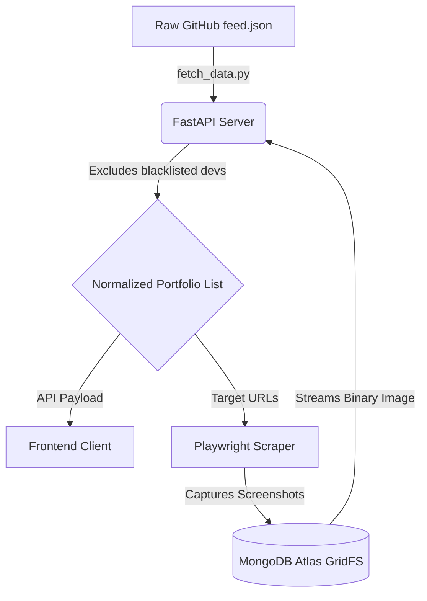

# DevFolio: Technical & Architectural Report

## 1. Executive Summary & Product Vision

### High-Level Overview
**DevFolio** is a high-performance web aggregator that transforms raw data from the popular `emmabostian/developer-portfolios` GitHub repository into a highly visual, interactive, and searchable developer gallery. Rather than navigating a static markdown table of 1,800+ links, users are presented with a premium, grid-based UI featuring automated screenshot previews, curated role filtering, and dynamic content loading.

### Problem Statement
Developers and recruiters seeking portfolio inspiration or candidates currently have to manually click through thousands of external links with no prior context of the portfolio's quality, tech stack, or aesthetic. Furthermore, open-source portfolio lists are often plagued by dead links, non-standardized job titles, and unresponsive sites.

### Proposed Solution & Value Proposition
DevFolio solves this by deploying an automated web-scraping microservice that captures incremental screenshots of every portfolio, storing them in a high-performance cloud database (MongoDB GridFS). It cleans and normalizes chaotic user-submitted job roles into 25 strict, professional categories. The result is a lightning-fast, visually rich discovery engine with a premium "Neo-Brutalist" design language.

---

## 2. System Architecture & Engineering Design

### High-Level Architecture
The system is built on a decoupled architecture comprising three main pillars:
1.  **Frontend Client (Vanilla Web):** A lightweight HTML/CSS/JS client relying on CSS Grid for layout and native DOM APIs for rapid, dependency-free rendering.
2.  **Backend Server (FastAPI):** An asynchronous Python API that parses the raw GitHub data, cross-references it with the database, and serves data payloads and binary image streams to the client.
3.  **Data & Scraping Engine (Playwright + MongoDB):** A headless Playwright service that intercepts network requests for speed, captures 3-part incremental screenshots, and stores them via Motor (async driver) into MongoDB Atlas GridFS.

### Data Flow


### Security & Integrity Strategies
-   **Scraper Isolation:** The Playwright engine intercepts and aborts heavy media loads (videos, iframes) and prevents execution of malicious scripts on external portfolios during capture.
-   **Data Sanitization:** Strict blocklisting (149 excluded dead/malicious links) and data normalization ensure the UI is not corrupted by malformed user inputs.

---

## 3. UI/UX Design Philosophy & Brand Identity

### Visual Aesthetic: Neo-Brutalist Professional
DevFolio utilizes a highly premium, **Neo-Brutalist** design aesthetic inspired by high-end modern web portfolios. It emphasizes structural clarity, stark contrasts, and utilitarian typography, avoiding generic corporate UI patterns.

### Design System
-   **Color Palette:**
    -   *Light Mode (Manila Paper):* Background `#efe3cf`, Foreground `#1a0f09`, Borders `#1a0f09`.
    -   *Dark Mode (Dark Espresso):* Background `#1a0f09`, Foreground `#efe3cf`, Borders `#efe3cf`.
-   **Typography:** Utilitarian Sans-Serif system fonts (`system-ui, -apple-system`) for strict legibility, accented by monospace elements for metadata.
-   **Component Architecture:** Hard-edged cards with thick borders (`var(--border-thick)`), flat solid shadows (`var(--shadow-flat)`), and absolute-positioned retro window controls.

### UX Decisions for Target Audience
-   **Hover-to-Scroll Mechanism:** Instead of requiring users to visit a portfolio just to see its layout, hovering over a card translates a 3-part stitched screenshot upwards, simulating a full-page scroll instantly.
-   **Ellipsis Tooltips:** Truncates excessive user role strings (`overflow: hidden`) to maintain strict card geometries, but exposes the full text via native browser tooltips (`title` attribute) on hover.

---

## 4. Technology Stack & Environment Setup

| Category | Technology | Purpose |
| :--- | :--- | :--- |
| **Frontend** | HTML5, CSS3, Vanilla JS | Lightweight, dependency-free client rendering. |
| **Backend API** | Python 3.11+, FastAPI | High-concurrency asynchronous API routing. |
| **Web Scraping** | Microsoft Playwright | Headless browser automation for accurate screenshot capture. |
| **Database** | MongoDB Atlas, Motor | Cloud storage utilizing GridFS to bypass 16MB document limits for images. |
| **Server Engine** | Uvicorn | ASGI web server implementation for Python. |

### Local Environment Setup

1.  **Clone & Environment Initialization:**
    ```bash
    python -m venv venv
    venv\Scripts\activate  # Windows
    ```
2.  **Install Dependencies:**
    ```bash
    pip install -r requirements.txt
    playwright install chromium
    ```
3.  **Environment Variables (`.env`):**
    ```env
    MONGO_URI=mongodb+srv://<username>:<password>@cluster.mongodb.net/
    MONGO_DB_NAME=devfolio
    ```
4.  **Launch the System:**
    ```bash
    # Terminal 1: Start API Server
    uvicorn backend.main:app --reload --port 8000
    
    # Terminal 2: Start Background Scraper (Optional)
    python backend/screenshot_service.py
    ```

---

## 5. Performance Optimization & Benchmarks

### Optimization Strategies
-   **Native Lazy Loading:** All 1,157 dynamic image assets are injected with `loading="lazy"`, ensuring the browser only fetches screenshots as they enter the viewport, saving immense bandwidth.
-   **Debounced Filtering:** The `app.js` search input is wrapped in a `setTimeout` debounce (250ms), preventing the browser from attempting to re-render a 1,000+ item DOM on every keystroke.
-   **DOM Diffing for Progress Updates:** The frontend avoids full-grid re-renders by targeting specific placeholder elements and swapping them with loaded screenshots seamlessly.
-   **Network Interception:** The backend scraper drops web fonts, media, and third-party trackers, reducing external page load times from ~8 seconds to ~2 seconds during capture.

---

## 6. Core Features & Business Logic

### Curated Role Normalization Engine
Raw data contains hundreds of fragmented, misspelled, or junk role titles (e.g., `8x google hall of fame`, `cs undergrad`, `developper`). The backend normalization engine uses strict regex bucketing to map these edge cases into **25 professional categories** (e.g., `AI/ML Engineer`, `Frontend Developer`). Unrecognized junk is mapped to `null` and purged from the filtering dropdown.

### Dynamic Grid Updates
The system supports asynchronous completion. Portfolios without screenshots yet display a "Preview Unavailable" brutalist placeholder. As the background scraper completes captures and pushes to MongoDB, the frontend dynamically polls the API and swaps placeholders for live images without requiring a page refresh.

---

## 7. API Documentation & Integration

| Method | Endpoint | Description |
| :--- | :--- | :--- |
| `GET` | `/api/portfolios` | Returns the master array of curated portfolios. |
| `GET` | `/api/screenshots/{filename}` | Streams binary image data directly from MongoDB GridFS. |

**Example Request:** `GET /api/portfolios`
**Expected Response:**
```json
{
  "count": 1157,
  "portfolios": [
    {
      "name": "Jane Doe",
      "role": "Full Stack Developer",
      "url": "https://janedoe.dev",
      "safe_name": "jane_doe_0",
      "has_screenshots": true
    }
  ]
}
```

---

## 8. Deployment Architecture

*(Note: Currently configured for local orchestration; production deployment roadmap below)*
-   **Backend:** Configured to be containerized and deployed to a PaaS (Render, Railway, or Heroku).
-   **Frontend:** Standard static files (`index.html`, `app.js`, `styles.css`) ready for CDN deployment (Vercel, Netlify) interacting with the backend via CORS.
-   **Database:** MongoDB Atlas is currently live in production, utilizing remote cloud compute to serve GridFS binaries globally.

---

## 9. Future Roadmap & R&D

-   **Pagination / Infinite Scroll:** While CSS Grid and native lazy-loading handle 1,157 items remarkably well, introducing an IntersectionObserver for infinite scrolling will reduce initial DOM node bloat.
-   **Webhooks for Real-Time Updates:** Replacing the current polling mechanism in `app.js` with WebSockets or Server-Sent Events (SSE) to notify the client the exact millisecond a new screenshot is uploaded to MongoDB.
-   **Automated Maintenance:** Implementing a scheduled cron job (GitHub Actions) to run the `fetch_data.py` script weekly to catch new submissions to the upstream `developer-portfolios` repository.
